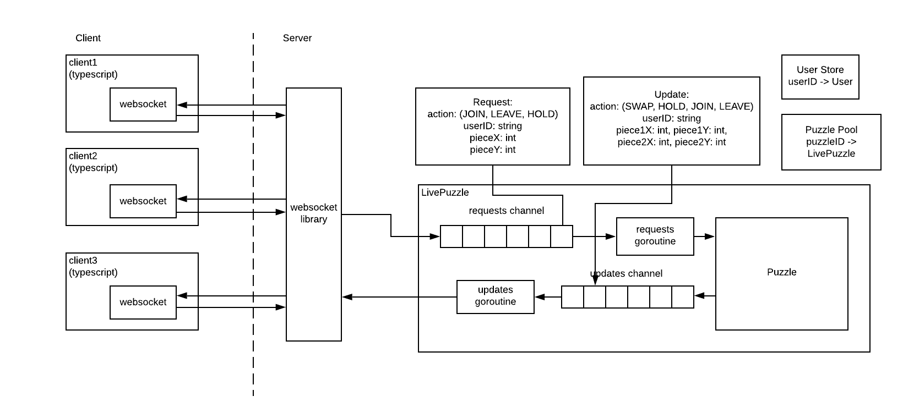

# Puzzle

Multiplayer puzzle server & client similar to [epuzzle.info](http://epuzzle.info)


## Server & Client Architecture

From a puzzle user's perspective, the only thing they can do is hold pieces. If they attempt to hold another 
piece when they already hold one, then the two pieces are swapped, and the user no longer holds any pieces.
In addition, users cannot hold pieces already held by other players. If they attempt to hold a piece
that they already hold, then they release the current piece. 
However, since we are making an interactive multiplayer puzzle, users are also able to join and leave puzzles.
These three actions, or _requests_, are represented therefore with an enum: `{JOIN, LEAVE, HOLD}`. 

When users swap a piece into its correct position, they are awarded points, and the "winner" is whoever has 
the most points at the end of the game. [puzzle.go](game/puzzle.go) implements the basic puzzle described above.

Because we are making a multiplayer puzzle, the puzzle object has to be threasafe. Actions are queued in a 
_requests_ channel, so they can be processed one after another sequentially. Updates for a puzzle's state need
to be sent to everyone currently working on the puzzle, so they are represented as a similar enum 
`{JOIN, LEAVE, HOLD, SWAP}` (The reason why we do not have a `RELEASE` enum is because `RELEASE` is esentially
the same as a swap). Updates of a puzzle are put on an _updates_ channel. 

[livepuzzle.go](game/livepuzzle.go) provides a threasafe interactable puzzle object that holds the 
basic puzzle object, and implements the two channels, and also spawns two goroutines to process the requests on 
the puzzle, and to multiplex the results to the client. 



With the livePuzzle, clients can load the puzzle state once via http, and then send puzzle requests and 
receive puzzle updates through a single websocket. However, because updates only represent a change of 
state, we could potentially lose updates after receiving the puzzle state via http, and before our web socket 
is connected. 

To make sure every client sees the same, correct puzzle state as the server, we connect to the websocket first
and store all the updates we receive, and then we load the puzzle state. We also label every puzzle update object
with a unique monotonically increasing update id, and add a field to the puzzle state that represents the next update
id. This way when the puzzle state is loaded, we can compare the next update id in the puzzle to the updates we 
received in the websocket, and only apply the ones where the udpate id >= puzzle's next update id in order. 

Ex:
1. Connect to websocket
2. Store all updates in the websocket, ex: received updates with id: 4, 5, 6, 7, 8, 9
3. Load puzzle state
4. Check puzzle.nextUpdateID: 7
5. Then, we know, given the current puzzle state, we can apply updates with id: 7, 8, 9
6. Now we are caught up and in sync with the server's view of the puzzle. 

## Small Demo
]

### HTTP API:
- `GET /api/images/...`
  - This is the route used to serve static images. Each image uploaded gets put in a unique folder, 
so that it can accessed like: 
    - `/api/images/<uuid>/original.jpeg`
    - `/api/images/<uuid>/preview.jpeg` (scaled down version to 200px length)
    - `/api/images/<uuid>/original_Y_X.jpeg` for pieces
- `POST /api/images`
  - multipart/form-data with image key
  - response
```json
  {"id": "uuid"}
```

- GET `/api/puzzles/{id}`
  - returns puzzle state

- GET `/api/puzzles/{id}/results`
  - gets current user map of how many pieces they got correct

- POST `/api/puzzles/{id}`
  - expects `application/json` with a `ySize` and `xSize`
  - creates a puzzle given the ySize and xSize, and the id of an image that was uploaded earlier

- WebSocket `/api/puzzles/{id}/ws?user={user id}`
  - connects to an existing puzzle, as the user specified in userid
  - receives updates, and allows messages to be sent

- GET `/api/users/{id}`
  - gets the info related to a user

- POST `/api/users/{id}`
  - expects `application/json` with a `name`
  - creates a user with a given `name`


## TODO:
- have normal user login with user & pass rather than unique ID 
- persist user store (rather than have it as an in memory map)
- have good server logging
- create reaper that goes through and cleans up directory/user data